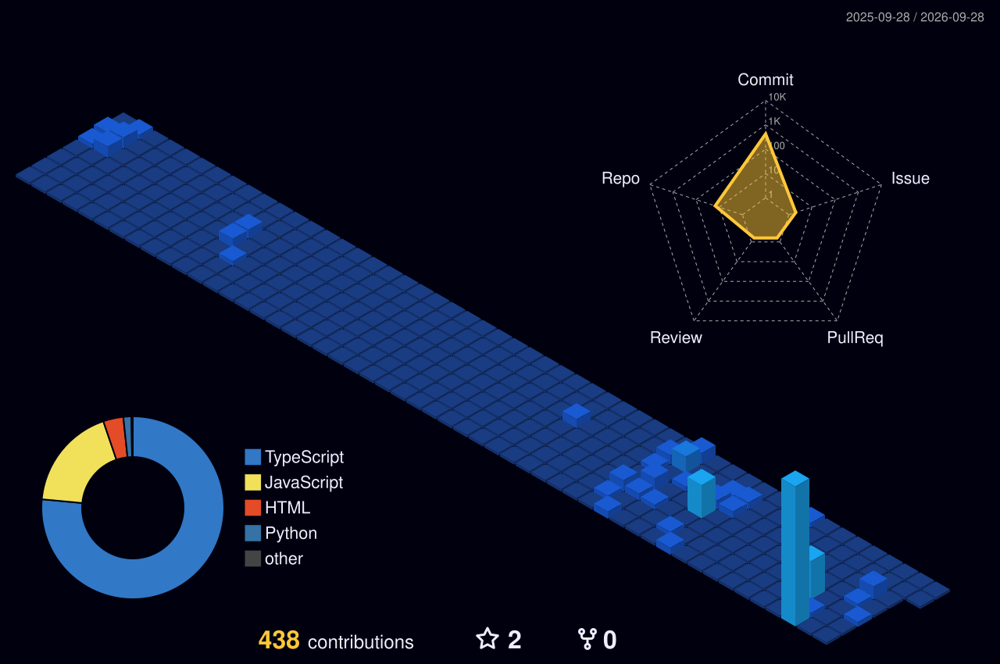
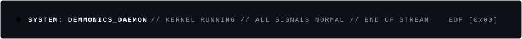

<div align="center">

<!-- ==================== ANIMATED CYBER HEADER ==================== -->


<!-- ==================== TOP BANNER ==================== -->


<br/><br/>

# Hi 👋, Imma Yoosha Abbas

<!-- ==================== ANIMATED TYPING TERMINAL ==================== -->
<p align="center">
  
</p>

<!-- ==================== BIOS BOOT SEQUENCE ==================== -->


<br/><br/>

<!-- ==================== CONNECT BADGES ==================== -->
<p align="center">
  <a href="https://github.com/Demmonics" target="_blank">
    
  </a>
  &nbsp;
  <a href="https://www.linkedin.com/in/yoosha-abbas-ab162a357" target="_blank">
    
  </a>
  &nbsp;
  <a href="mailto:yooshaabbas2005@gmail.com" target="_blank">
    
  </a>
  &nbsp;
  <a href="https://www.youtube.com" target="_blank">
    
  </a>
</p>

</div>

<br/>


### ▓▒░ [01] ABOUT ME // DOSSIER

<table border="0" cellpadding="14" cellspacing="0" width="100%">
  <tr>
    <td width="62%" valign="top">
      <br/>
      <p>
        <b>▸ IDENTITY &amp; CORE FOCUS:</b><br/>
        Second-year <b>Artificial Intelligence &amp; Data Science</b> student based in Mumbai. Operating at the intersection of mathematical computing, high-end post-production, and interactive cyber-aesthetic software.
      </p>
      <p>
        <b>▸ CAMPUS LEADERSHIP &amp; ORGANIZATIONS:</b><br/>
        • <b>Creative Head</b> — K.J. Somaiya College of Engineering Students' Council.<br/>
        • <b>Creative Team</b> — Computer Society of India (CSI) student chapter.<br/>
        • <b>Special Interest Group (SIG) Lead</b> — Directing research sessions in Quantum Machine Learning.
      </p>
      <p>
        <b>▸ CREATIVE PRODUCTION:</b><br/>
        Freelance video director, compositor, and 3D visual artist. Deep production workflows spanning Premiere Pro, DaVinci Resolve Studio, After Effects, and Blender.
      </p>
      <p>
        <b>▸ TECHNICAL PHILOSOPHY:</b><br/>
        Refusing to separate engineering rigor from visual ecstasy. Whether developing legal AI RAG pipelines, WebGL product experiences, or After Effects native tooling, every build must deliver zero latency and brutalist elegance.
      </p>
    </td>
    <td width="38%" align="center" valign="middle">
      
    </td>
  </tr>
</table>

<br/>


### ▓▒░ [02] WEAPONS OF CHOICE // TECH ARSENAL

#### ⌨️ Core Languages & Runtimes
<p align="left">
  
  
  
  
  
  
  
</p>

#### ⚡ Frontend, 3D & Creative WebGL
<p align="left">
  
  
  
  
  
</p>

#### 🖥️ Backend, Systems & Native
<p align="left">
  
  
  
  
  
</p>

#### 🧠 AI, Vector Retrieval & Databases
<p align="left">
  
  
  
  
  
  
</p>

#### 🎬 Motion Graphics, 3D Modeling & Post-Production
<p align="left">
  
  
  
  
  
  
</p>

<br/>


### ▓▒░ [03] PROJECT SHOWCASE // FEATURED ARCHITECTURES

<table width="100%" border="0" cellpadding="8" cellspacing="0">
  <tr>
    <td width="50%" valign="top">
      <!-- Project Card 1 -->
      <table width="100%" style="background-color: #0d1117; border: 1px solid #30363d; border-radius: 6px;" cellpadding="12">
        <tr>
          <td>
            <h3>⚖️ NYAYA-TRIAGE</h3>
            <p><b>Legal AI Triage &amp; Case Analytics Platform (SIH)</b></p>
            <p>Multi-role portal with 3D Lady Justice WebGL canvas, hybrid dense-sparse retrieval (Qdrant + BM25), IPC-to-BNS statutory mapper, and citation-grounded synthesis.</p>
            <p>
              <code>FastAPI</code> <code>React 19</code> <code>Three.js</code> <code>Qdrant</code> <code>Gemini</code> <code>Supabase</code>
            </p>
            <p>
              <a href="https://github.com/Demmonics/nyaya-triage"><b>[ REPO ]</b></a> &nbsp;•&nbsp; 
              <a href="./repo-readmes/nyaya-triage.md"><b>[ ARCHITECTURE DOCS ]</b></a>
            </p>
          </td>
        </tr>
      </table>
    </td>
    <td width="50%" valign="top">
      <!-- Project Card 2 -->
      <table width="100%" style="background-color: #0d1117; border: 1px solid #30363d; border-radius: 6px;" cellpadding="12">
        <tr>
          <td>
            <h3>⚡ STASH (AE ASSET BROWSER)</h3>
            <p><b>Visual Asset Browser Panel for Adobe After Effects</b></p>
            <p>High-performance CEP panel indexing 3,500+ templates with 16:9 hover video previews, interactive waveform SFX players, automatic MOGRT unpacking, and 1-click timeline injection.</p>
            <p>
              <code>Adobe CEP</code> <code>Node.js</code> <code>ExtendScript</code> <code>Spectrum UI</code> <code>MOGRT</code>
            </p>
            <p>
              <a href="https://github.com/Demmonics/stash"><b>[ REPO ]</b></a> &nbsp;•&nbsp; 
              <b>STATUS:</b> <code>Production Ready</code>
            </p>
          </td>
        </tr>
      </table>
    </td>
  </tr>
  <tr>
    <td width="50%" valign="top">
      <!-- Project Card 3 -->
      <table width="100%" style="background-color: #0d1117; border: 1px solid #30363d; border-radius: 6px;" cellpadding="12">
        <tr>
          <td>
            <h3>🏛️ KJSSE STUDENTS' COUNCIL SITE</h3>
            <p><b>Official Institutional Digital Hub &amp; Fest Portal</b></p>
            <p>Kinetic college portal serving thousands of students across departments, departmental council directories, real-time festival registrations, and secure administrative gateways.</p>
            <p>
              <code>React</code> <code>TypeScript</code> <code>Three.js</code> <code>Express</code> <code>MongoDB</code> <code>Railway</code>
            </p>
            <p>
              <a href="https://github.com/Demmonics/stuco_website"><b>[ REPO ]</b></a> &nbsp;•&nbsp; 
              <a href="./repo-readmes/kjsse-council.md"><b>[ SPECS ]</b></a>
            </p>
          </td>
        </tr>
      </table>
    </td>
    <td width="50%" valign="top">
      <!-- Project Card 4 -->
      <table width="100%" style="background-color: #0d1117; border: 1px solid #30363d; border-radius: 6px;" cellpadding="12">
        <tr>
          <td>
            <h3>💻 MACBOOK PRO 3D SHOWCASE</h3>
            <p><b>Photorealistic 3D Product Page with GSAP Choreography</b></p>
            <p>Interactive Apple MacBook Pro landing page featuring real-time 3D geometry manipulation, material swaps, and camera dolly zoom mapped to kinetic scroll triggers.</p>
            <p>
              <code>React</code> <code>Three.js</code> <code>React Three Fiber</code> <code>GSAP ScrollTrigger</code>
            </p>
            <p>
              <a href="https://github.com/Demmonics/Apple-macbook-landing-page"><b>[ REPO ]</b></a> &nbsp;•&nbsp; 
              <a href="https://demmonics.github.io"><b>[ LIVE DEMO ]</b></a>
            </p>
          </td>
        </tr>
      </table>
    </td>
  </tr>
  <tr>
    <td width="50%" valign="top">
      <!-- Project Card 5 -->
      <table width="100%" style="background-color: #0d1117; border: 1px solid #30363d; border-radius: 6px;" cellpadding="12">
        <tr>
          <td>
            <h3>🧠 NEURO-FUZZY ANFIS LAB</h3>
            <p><b>Adaptive Neuro-Fuzzy Inference Simulation</b></p>
            <p>Interactive simulation visualizing the synergy of fuzzy logic and gradient descent neural adaptation. Includes rotating 3D network topology and real-time Gaussian curve tracking.</p>
            <p>
              <code>React 18</code> <code>Three.js</code> <code>Gaussian MFs</code> <code>Sugeno Aggregation</code>
            </p>
            <p>
              <a href="https://github.com/Demmonics/soft-computing-ia"><b>[ REPO ]</b></a> &nbsp;•&nbsp; 
              <b>STATUS:</b> <code>Verified Academic</code>
            </p>
          </td>
        </tr>
      </table>
    </td>
    <td width="50%" valign="top">
      <!-- Project Card 6 -->
      <table width="100%" style="background-color: #0d1117; border: 1px solid #30363d; border-radius: 6px;" cellpadding="12">
        <tr>
          <td>
            <h3>🎮 2D PIXEL-ART PORTFOLIO GAME</h3>
            <p><b>System-Driven Interactive Game World</b></p>
            <p>Retro 2D pixel-art game engine featuring custom Rect hitbox physics, angle-based movement, camera tracking, and collision-triggered dialogue mechanisms.</p>
            <p>
              <code>JavaScript (ES6)</code> <code>Kaboom.js</code> <code>Tiled Map Editor</code> <code>Vite</code>
            </p>
            <p>
              <a href="https://github.com/Demmonics/2D-Portfolio"><b>[ REPO ]</b></a> &nbsp;•&nbsp; 
              <b>STATUS:</b> <code>Playable</code>
            </p>
          </td>
        </tr>
      </table>
    </td>
  </tr>
</table>

<br/>

#### 🧪 INCUBATOR // ACTIVE RESEARCH &amp; WORK IN PROGRESS

<table width="100%" border="0" cellpadding="6" cellspacing="0">
  <tr>
    <td width="50%" valign="top">
      <p><b>• ⚖️ NYAYA-QWEN (Local Offline Legal RAG)</b><br/>
      <small>Local RAG pipeline utilizing Ollama <code>qwen3:8b</code> + 400+ pages of the Constitution of India. Deterministic post-inference citation checking.</small><br/>
      <a href="./repo-readmes/nyaya-qwen.md"><b>[ View Architecture ]</b></a>
      </p>
    </td>
    <td width="50%" valign="top">
      <p><b>• 📓 CHRONOS (Encrypted Desktop Journal)</b><br/>
      <small>Offline-first Tauri v2 desktop app written in Rust + React with encrypted SQLite storage and automated rolling backups.</small><br/>
      <a href="./repo-readmes/personal-journal-tauri.md"><b>[ View Architecture ]</b></a>
      </p>
    </td>
  </tr>
  <tr>
    <td width="50%" valign="top">
      <p><b>• 🔒 EPHEMERAL P2P ENCRYPTED CHAT</b><br/>
      <small>Zero-knowledge peer-to-peer communication platform using WebRTC Data Channels and client-side AES-256-GCM encryption.</small><br/>
      <a href="./repo-readmes/ephemeral-chat-webrtc.md"><b>[ View Architecture ]</b></a>
      </p>
    </td>
    <td width="50%" valign="top">
      <p><b>• ♟️ GRANDMASTER AI (Offline Chess Engine)</b><br/>
      <small>Deterministic offline chess engine with bitboard move validation, Minimax alpha-beta pruning, and tactical puzzle trainer.</small><br/>
      <a href="./repo-readmes/chess-teaching-app.md"><b>[ View Architecture ]</b></a>
      </p>
    </td>
  </tr>
</table>

<br/>


### ▓▒░ [04] GITHUB TELEMETRY &amp; LIVE ACTIVITY

<div align="center">

  <!-- ==================== UNIFIED 2026 ANIMATED CONTRIBUTION SNAKE ==================== -->
  <p><b>🐍 2026 CONTRIBUTION ACTIVITY &amp; SNAKE (JAN – SEP) 🐍</b></p>
  

  <br/><br/>

  <!-- ==================== 3D ISOMETRIC CONTRIBUTION GRAPH ==================== -->
  <p><b>🧊 ISOMETRIC CONTRIBUTION TOPOGRAPHY 🧊</b></p>
  

  <br/><br/>

  <!-- ==================== STREAK STATS ==================== -->
  

  <br/><br/>

  <!-- ==================== GITHUB STATS & LANGUAGES ==================== -->
  <p align="center">
    
    &nbsp;
    
  </p>

</div>

<br/>


### ▓▒░ [05] CREATIVE PHILOSOPHY // REZTOKIA

<div align="center">


<br/><br/>

```text
╔══════════════════════════════════════════════════════════════════════╗
║ "Hard work and dedication towards a craft leads to creative ecstasy."║
║                         — PROJECT.EXE TERMINAL                       ║
╚══════════════════════════════════════════════════════════════════════╝
```

<p align="center" style="max-width: 650px;">
  <i>"<b>Reztokia (noun)</b>: A state of creative ecstasy characterized by a feeling of overwhelming joy, fulfillment and pride, triggered by moments of intense satisfaction with one's creative work. The rush of dopamine and adrenaline are so powerful that in these moments of creative satisfaction the mind is entirely overwhelmed by the emotion. The feeling is incredibly rare and can only be achieved by hard work and dedication towards a craft."</i>
</p>

</div>

<br/>

<!-- ==================== SYSTEM SHUTDOWN FOOTER ==================== -->
<div align="center">
  
  <br/><br/>
  
</div>
