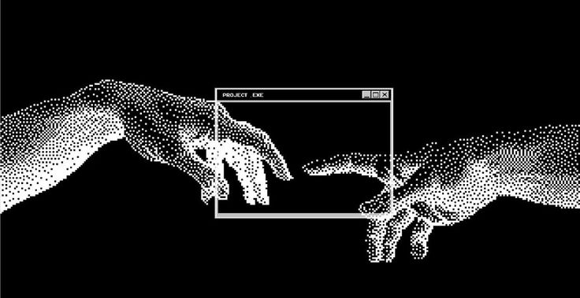
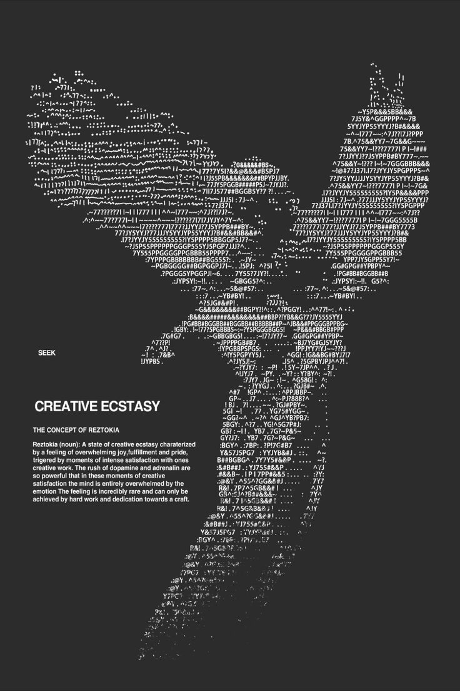

<div align="center">

<!-- ==================== HEADER BANNER ==================== -->


<br/><br/>

# Hi 👋, Imma Yoosha Abbas
### ⌁ `Student & Creative Developer / Video Editor` ⌁
*Passionate about creativity, visual arts, motion design, and code.*

```text
┌───[ SYSTEM: DEMMONICS.SYS ]─────────────────────────────────────────┐
│ STATUS: ONLINE  │  LOC: MUMBAI  │  MODE: DARK MONOCHROME  │  v1.0   │
└─────────────────────────────────────────────────────────────────────┘
```

<!-- ==================== SOCIAL / CONNECT BADGES ==================== -->
<p align="center">
  <a href="https://github.com/Demmonics" target="_blank">
    
  </a>
  &nbsp;
  <a href="https://www.linkedin.com/in/yoosha-abbas-ab162a357" target="_blank">
    
  </a>
  &nbsp;
  <a href="mailto:yooshaabbas2005@gmail.com" target="_blank">
    
  </a>
  &nbsp;
  <a href="https://www.youtube.com" target="_blank">
    
  </a>
</p>

</div>

<br/>

---

### ▓▒░ [01] ABOUT ME

<table border="0" cellpadding="10" cellspacing="0" width="100%">
  <tr>
    <td width="60%" valign="top">
      <br/>
      <p>
        <b>▸ BIO:</b><br/>
        Student, passionate about creativity, video editing, and interactive media.
      </p>
      <p>
        <b>▸ CURRENT FOCUS:</b><br/>
        Bridging high-end post-production, motion graphics, and 3D modeling with modern creative frontend development (Three.js, React, GSAP).
      </p>
      <p>
        <b>▸ TECHNICAL INTERESTS:</b><br/>
        Visual arts, video editing & compositing, 3D animation in Blender, generative web graphics, and retro/cyber-gothic aesthetics.
      </p>
      <p>
        <b>▸ THE CONCEPT OF REZTOKIA:</b><br/>
        <i>"A state of creative ecstasy characterized by a feeling of overwhelming joy, fulfillment and pride, triggered by moments of intense satisfaction with one's creative work. The feeling is incredibly rare and can only be achieved by hard work and dedication towards a craft."</i>
      </p>
    </td>
    <td width="40%" align="center" valign="middle">
      
    </td>
  </tr>
</table>

<br/>

---

### ▓▒░ [02] TECH STACK & ARSENAL

#### ⌨️ Languages & Frameworks
<p align="left">
  
  
  
  
  
  
</p>

#### 🎬 Video Editing, Motion Graphics & 3D
<p align="left">
  
  
  
  
  
  
  
  
  
  
  
</p>

#### 🎨 Photo & Graphic Editing
<p align="left">
  
  
  
  
  
  
</p>

#### 🌱 Currently Learning
<p align="left">
  
  
</p>

<br/>

---

### ▓▒░ [03] GITHUB STATS & ACTIVITY

<div align="center">

  

  <br/><br/>

  

  <br/><br/>

  <!-- Contribution Graph -->
  <p><b>CONTRIBUTION ACTIVITY</b></p>
  

</div>

<br/>

---

### ▓▒░ [04] CREATIVE PHILOSOPHY

<div align="center">



<br/><br/>

```text
╔══════════════════════════════════════════════════════════════════════╗
║ "Hard work and dedication towards a craft leads to creative ecstasy."║
║                         — PROJECT.EXE TERMINAL                       ║
╚══════════════════════════════════════════════════════════════════════╝
```

</div>
